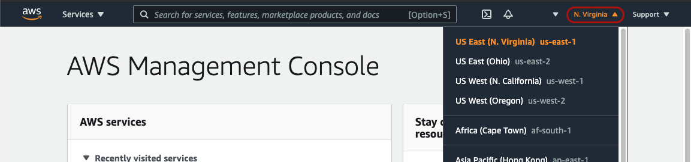
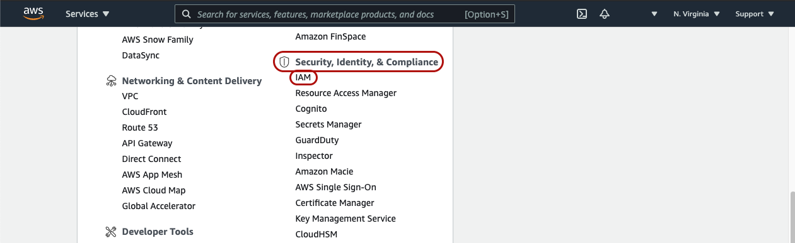
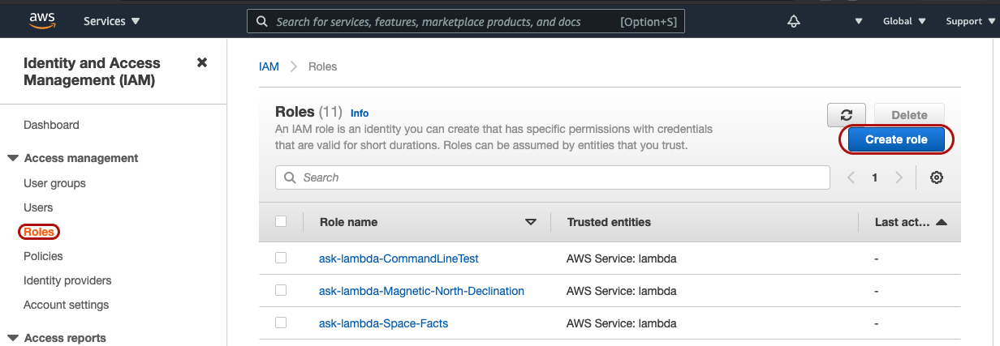
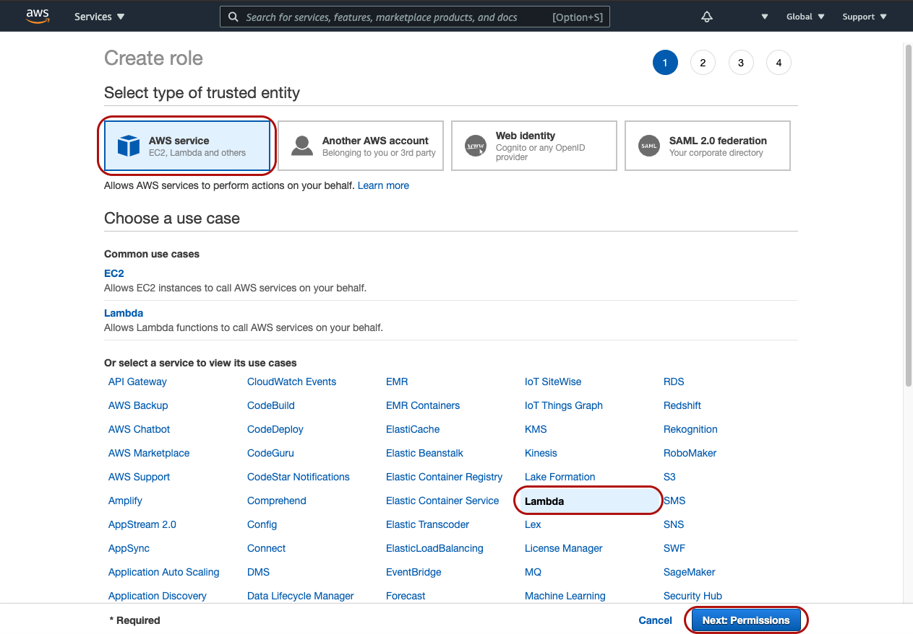
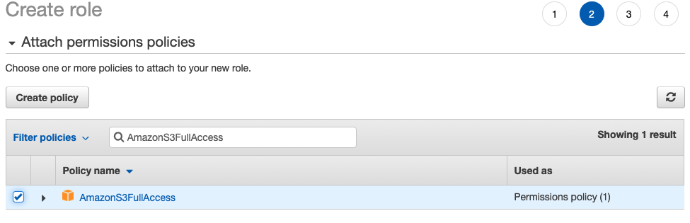
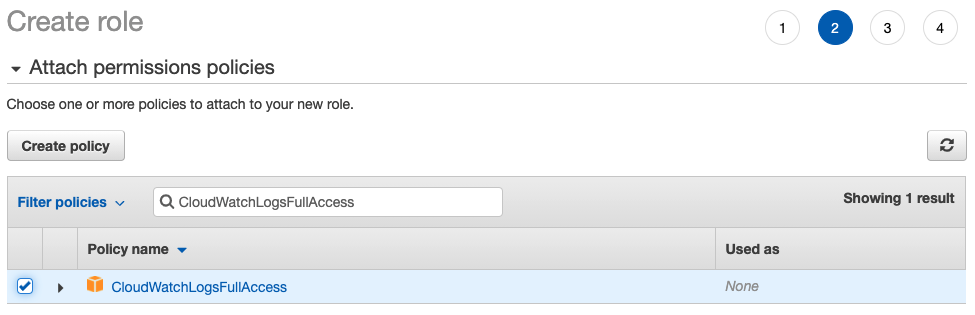
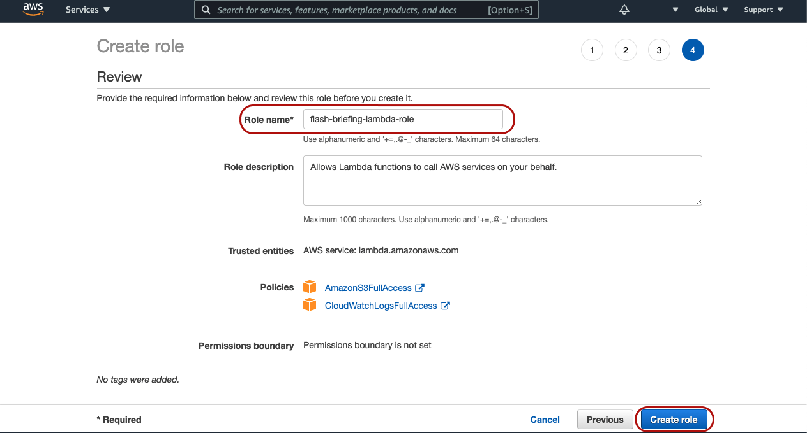

## 1. Create A Lambda Execution Role With Appropriate Permissions

Before we can get started creating your Lambda function, we must first define an IAM "role" to associate with your Lambda function. The IAM role defines what AWS resources your Lambda function has permission to use.

1. Log into your [AWS Managment Console](https://aws.amazon.com/console/)
2. In the upper-right, choose your desired AWS region. For this walkthrough, I'll be using "US East (N. Virginia) us-east-1" for all resources.

3. Click to expand "All Services" and then under "Security, Identity, & Compliance" choose "IAM"

4. Under "Access managment" click "Roles" and then click the "Create role" button.

5. Under "Select type of trusted entity" choose "AWS service". Then, under "Or select a service to view its use cases" choose "Lambda" and then click "Next: Permissions"

6. In the search bar, input, and check the box next to each of the following policies:
    * AmazonS3FullAccess
    
    * CloudWatchLogsFullAccess
    
7. In the bottom right, click "Next: Tags" followed by "Next: Review"
    * **Note:** Tags are optional and do not have any functional impact on your resources. You may want to use tags to help keep your resources organized though.
8. On the "Review" page, provide a descriptive role name, for example, "flash-briefing-lambda-role", and then click "Create role"

[Next Step: 2. Create Your Lambda Function >>](./2-create-lambda-function.md)