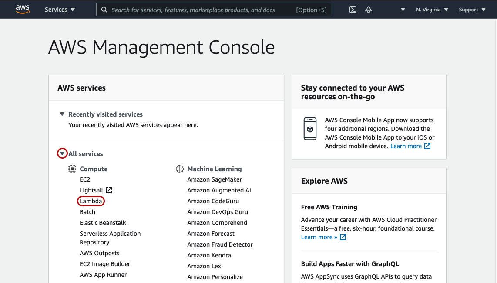
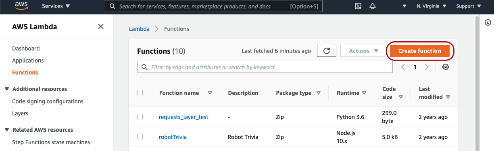
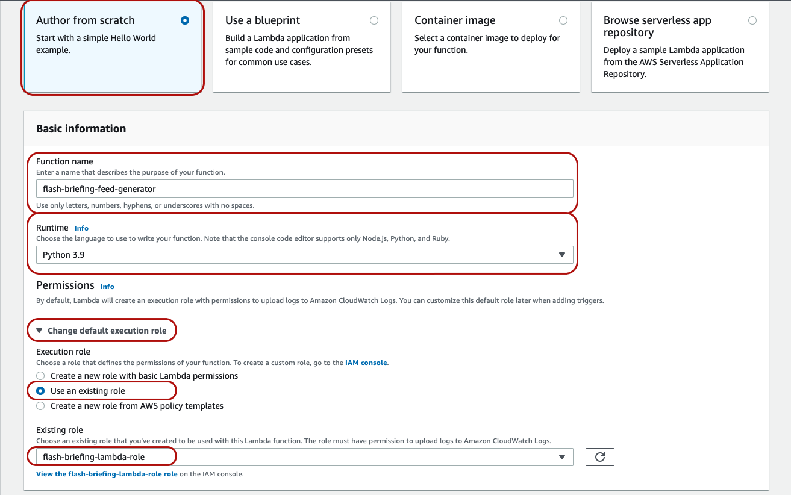

## 2. Create Your Lambda Function

1. Navigate back to your [AWS Managment Console home page](https://console.aws.amazon.com/console/home)
2. Click to expand "All Services" and then under "Compute" choose "Lambda"

3. Click the "Create function" button in the upper-right

4. With the default "Author from scratch" option selected, configure your Lambda function as follows:
    * Function name: Any unique name that you'll remember, for example, "flash-briefing-feed-generator"
    * Runtime: Python 3.9
    * Change default execution role > Use an existing role: Choose the "flash-briefing-lambda-role" that we created previously.
    
5. Click "Create function"

At this point, you should have successfully created a Lambda function. Before we can actually copy and paste the Lambda code and configure the Lambda function though, we will need to create and configure an S3 bucket where you'll store your .mp3 audio files.

[Next Step: 3. Create Your S3 Bucket >>](./3-create-s3-bucket.md)