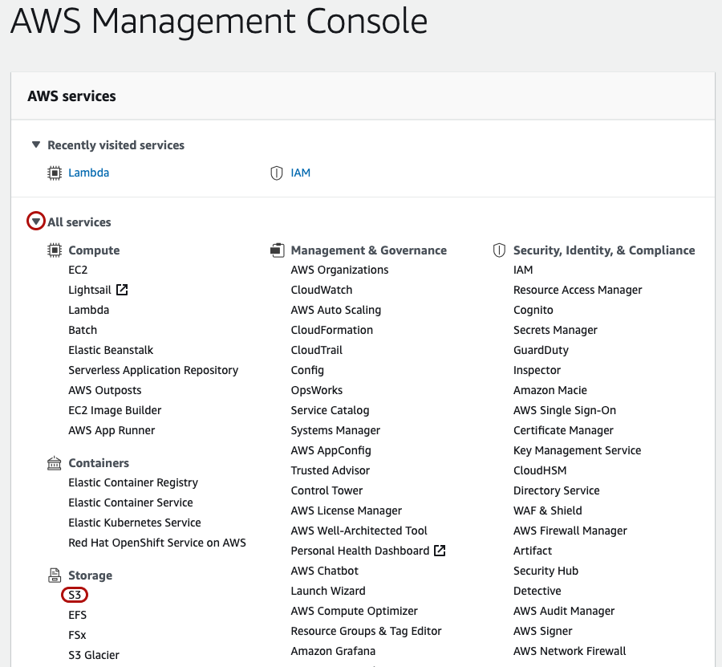
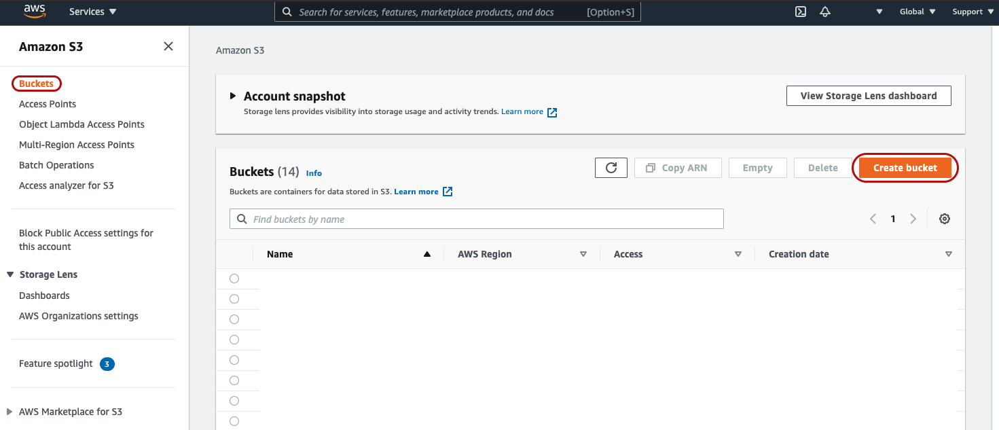
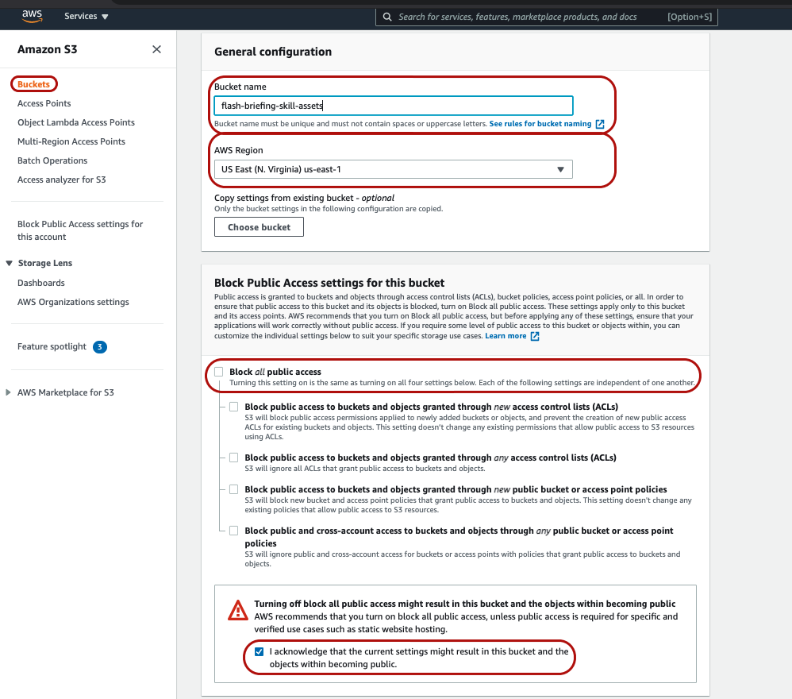

## 3. Create Your S3 Bucket

1. Navigate back to your [AWS Managment Console home page](https://console.aws.amazon.com/console/home)
2. Click to expand "All Services" and then under "Storage" choose "S3"

3. Click the "Create bucket" button in the upper-right

4. Configure your S3 bucket as follows:
    * Bucket name: Any unique name that you'll remember
        * **Note**: S3 bucket names must be *globally unique*. Becuase of that, you may want to append something to the name of the bucket, like the name of your skill, or a domain name that you own just to ensure the name isn't already taken by someone else.
    * AWS Region: US East (N. Virginia) us-east-1
        * **Note**: Because our Lambda function is located in us-east-1, we'll create our S3 bucket in the same region to ensure that they can easily communicate with one another.
    * Un-check the "Block all public access" box and check the "I acknowledge that the current settings might result in this bucket and the objects within becoming public.
        * **Note**: This will not make all objects within our S3 bucket public by default, but it will allow us to make objects public. This suites our needs since our skill's flash briefing .json feed and .mp3 files will need to be public in order for people to retrieve our content.
    
5. Click "Create bucket"

[Next Step: 4. Configure Your S3 Bucket With Events >>](./4-configure-s3-bucket.md)