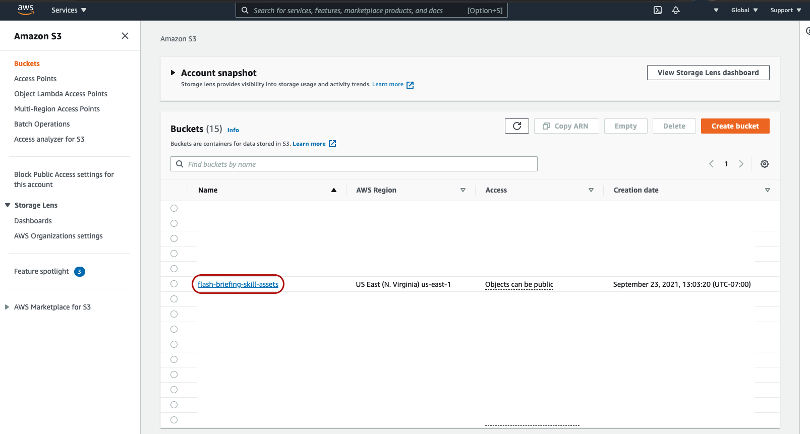
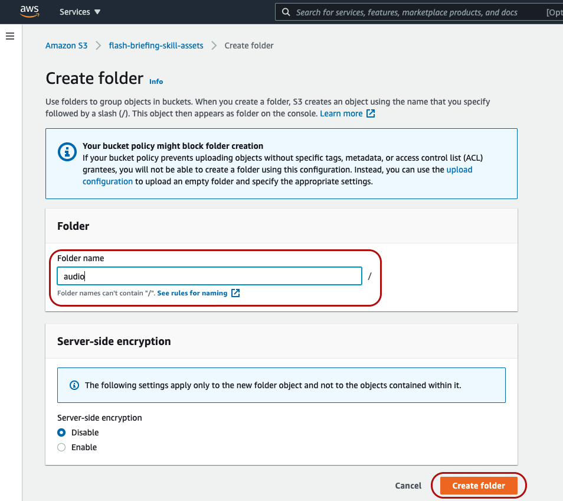
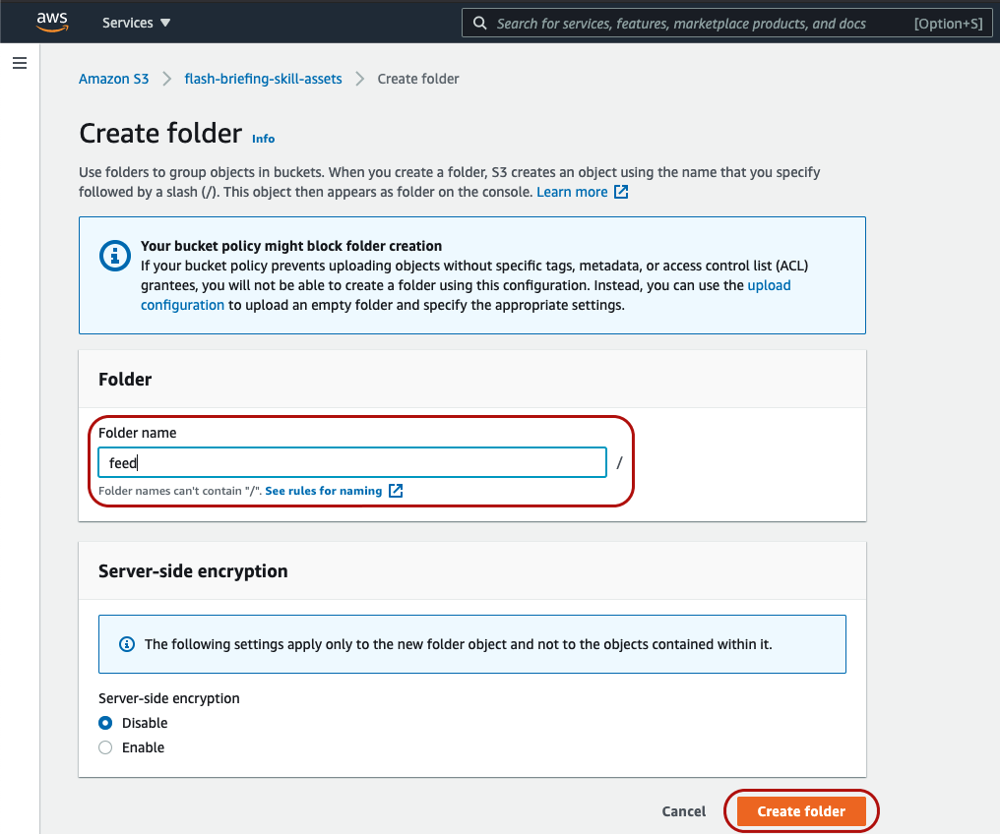
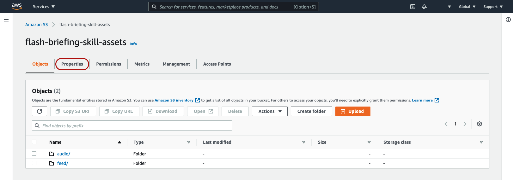
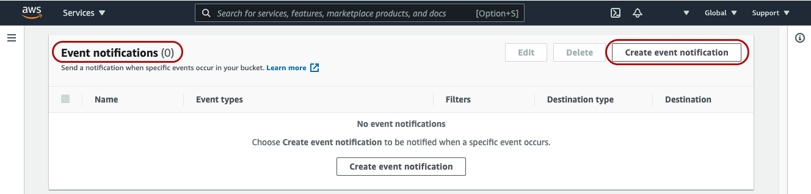
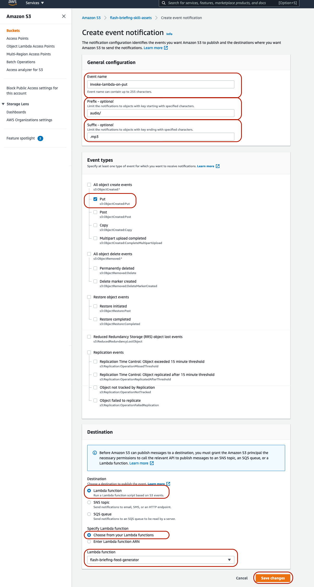

## 4. Configure Your S3 Bucket With Events

1. Click the name of the bucket you just created

2. Click the "Create folder" button and create a folder named "audio".

3. Click the "Create folder" button again and create another folder, this one named "feed".

4. Click the "Properties" tab

5. Scroll down to the section titled "Event Notifications" and click "Create event notification"

6. Configure your S3 bucket's event notification as follows:
    * Event Name: Any unique name that you'll remember
    * Prefix: audio/
        * **Note**: Don't forget to inclide the forward slash
    * Suffix: .mp3
    * Event Types: Check the box next to "Put" only
    * Destination > Lambda Function: Choose the Lambda function that you created previously
    * Click "Save Changes"
    

[Next Step: 5. Configure Your Lambda Function >>](./5-configure-lambda-function.md)