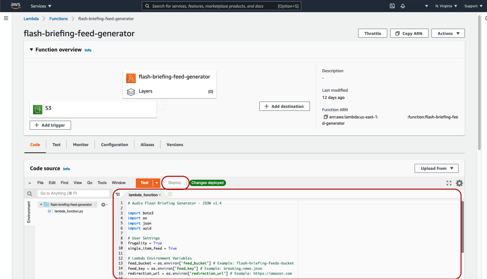
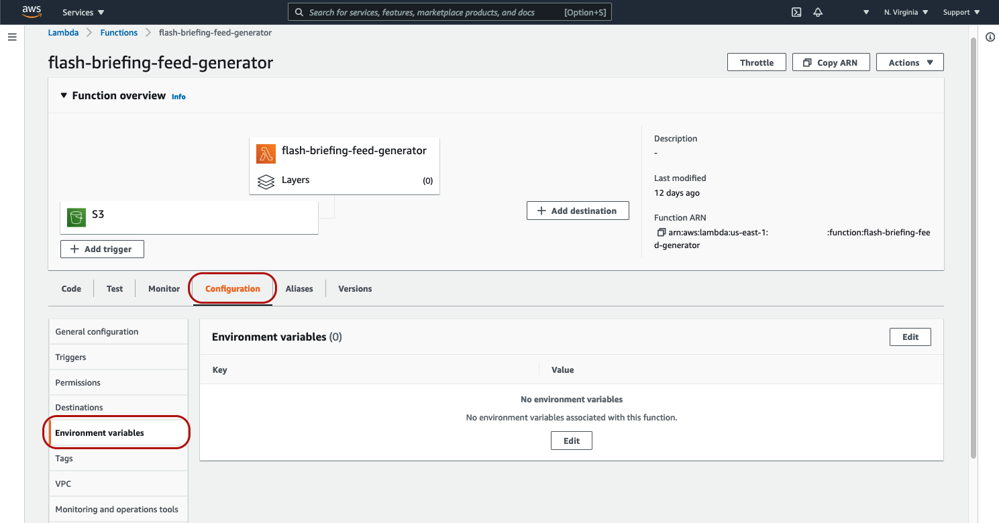
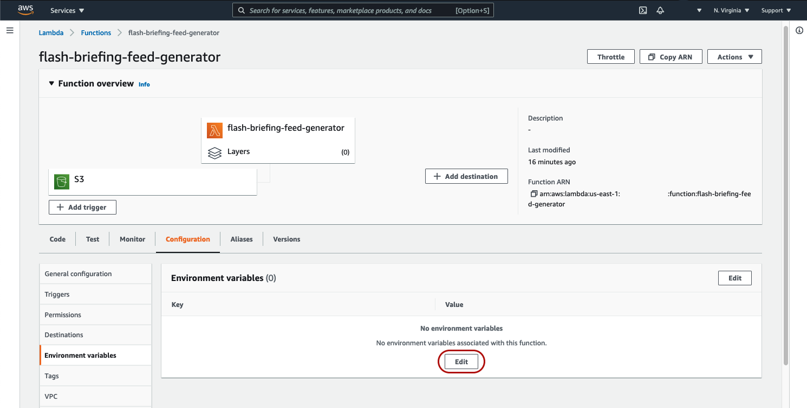
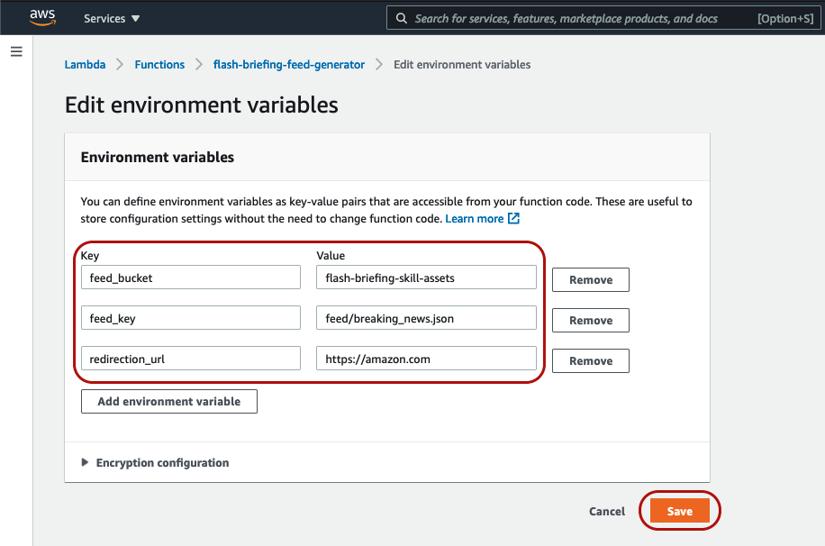

## 5. Configure Your Lambda Function

1. Navigate back to your [AWS Managment Console home page](https://console.aws.amazon.com/console/home)
2. Click to expand "All Services" and then under "Compute" choose "Lambda"

3. Click the "Function name" of your previously created Lambda function.
    * Note: You should now see that there's an "S3" trigger associated with your Lambda function.
4. Copy the contents of this repository's [lambda_function.py](../lambda_function.py) and paste the code into your own Lambda function's lambda_function.py. Be sure to click the "Deploy" button. The end result should look something like the following:

5. Click the "Configuration" tab and choose "Environment variables"

6. In the "Environment variables" box, click "Edit"

7. On the "Edit environment variables" page, click "Add environment variable" three times and input the following key / value pairs and click "Save".

|      Key      |            Value           |             Example Value            |
|---------------|----------------------------|--------------------------------------|
|feed_bucket    |your-s3-bucket-name         |flash-briefing-skill-assets           |
|feed_key       |feed/desired_feed_name.json|feed/breaking_news.json               |
|redirection_url|The URL for the Read More link in the Alexa app.|https://amazon.com|

[Next Step: 6. Test Your Setup >>](./6-test-setup.md)