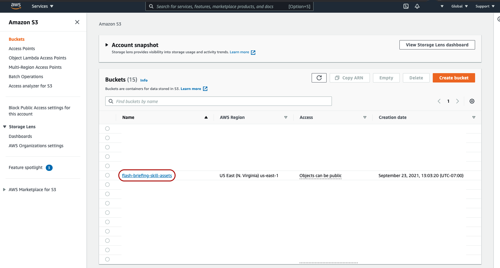
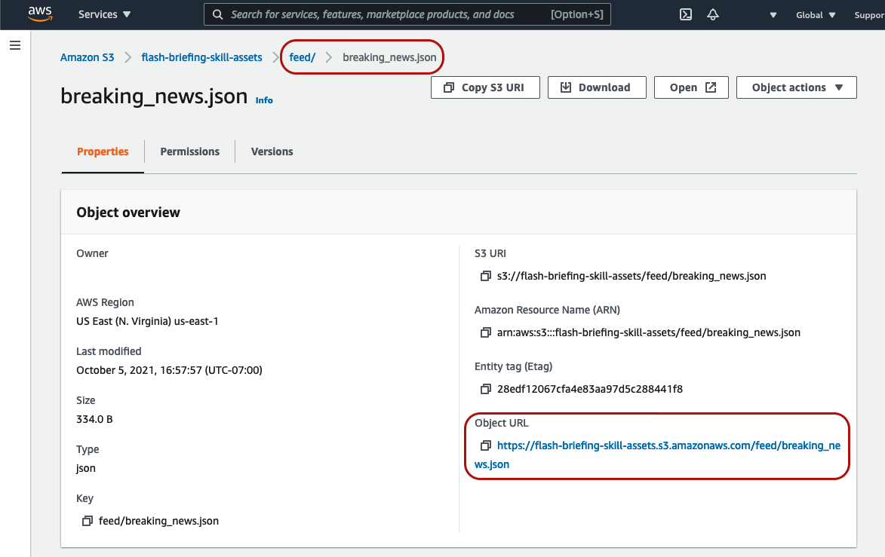

## 6. Test Your Setup

At this point, you're done with configuring S3 and Lambda! All that's left to do is to test your setup! We'll do this by simply uploading an .mp3 file to the "audio/" folder of our S3 bucket. That act alone should invoke our Lambda function and create a well formatted .json file within our S3 bucket's "feed/" folder.

1. Click the name of the bucket you just created

2. Click the "audio/" folder and click "Upload"

3. On the "Upload" page, click "Add files", choose the .mp3 you'd like to upload and then click "Upload"
    * Note: If you'd like to borrow an .mp3 file, you may use the [Test Audio File.mp3](../assets/Test%20Audio%20File.mp3) from this repository.

4. Navigate back to your bucket's "/feed" folder and have a look! You should now see a well formatted .json flash briefing feed!

    * Note: The "Object URL" is the "feed" link you'll use within your flash briefing skill.

Your flash briefing feed .json should look something like the following:

```
[
    {
        "mainText": "",
        "redirectionUrl": "https://amazon.com",
        "streamUrl": "https://s3.amazonaws.com/flash-briefing-skill-assets/audio/Test+Audio+File.mp3",
        "titleText": "Test Audio File",
        "uid": "d955c6ec-dd53-49b3-a7ba-c9626df349b4",
        "updateDate": "2021-10-06T00:33:16.232Z"
    }
]
```

[Extra Credit: 7. Configuration Options & Design Choices >>](./7-configuration-options.md)